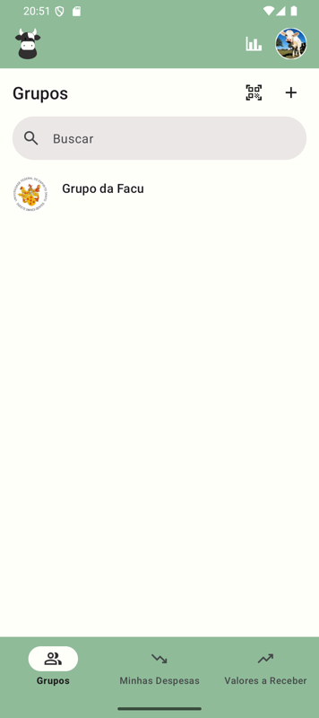
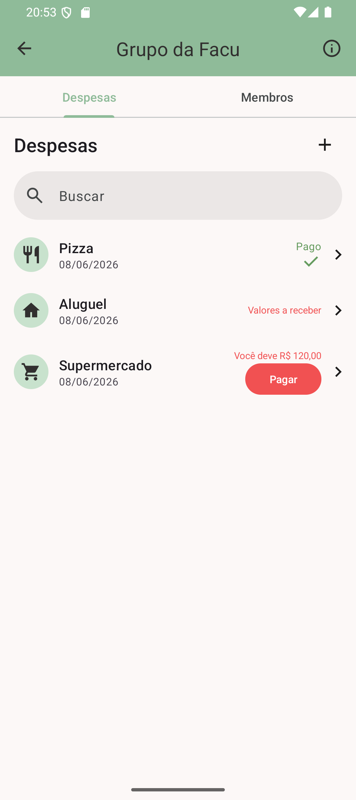
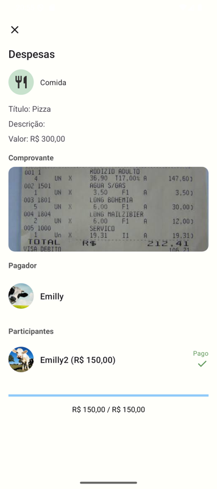
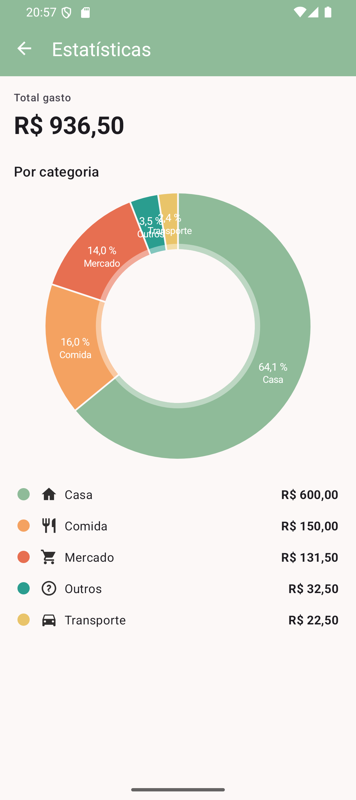
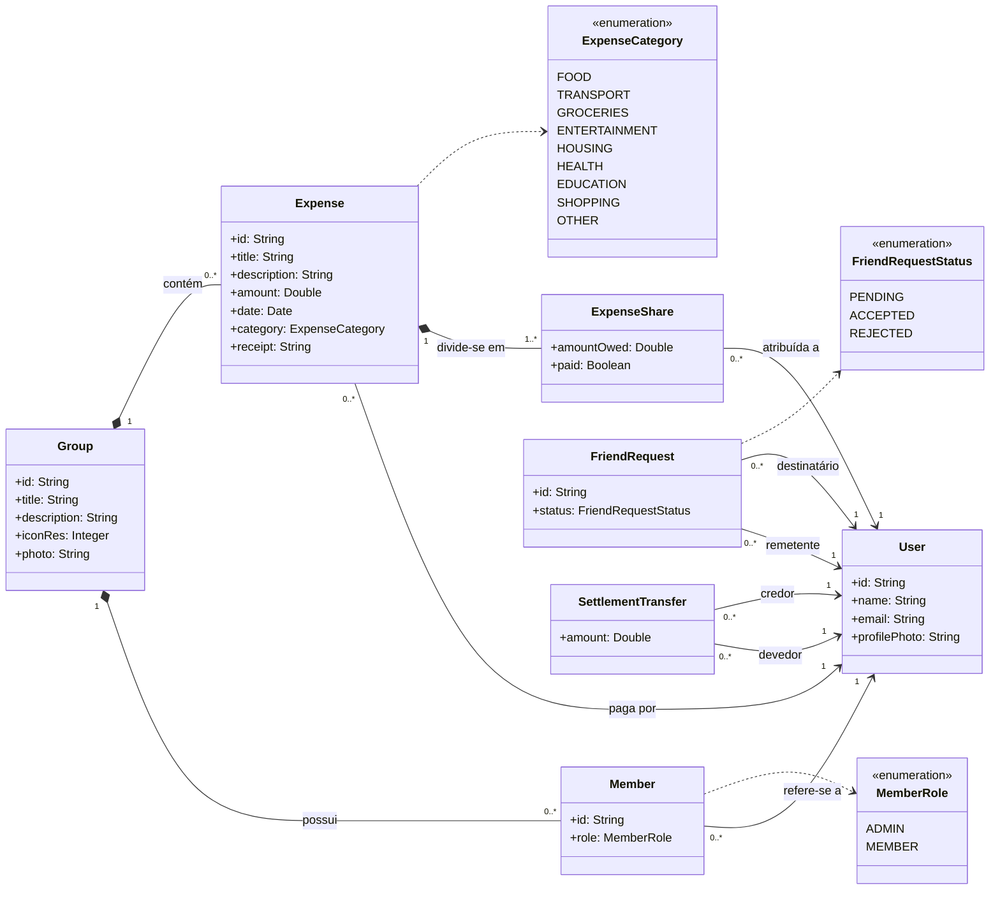

<h1 align="center">DivideAi 💸</h1>

<p align="center">
  Aplicativo Android para dividir despesas em grupo de forma justa, simples e transparente.
</p>

<p align="center">
  
  
  
  
  
  
</p>

---

## 📑 Índice

- [Sobre o Projeto](#-sobre-o-projeto)
- [Público-Alvo](#-público-alvo)
- [Funcionalidades](#-funcionalidades)
- [Telas do App](#-telas-do-app)
- [Como Usar](#-como-usar)
- [Arquitetura e Detalhes Técnicos](#-arquitetura-e-detalhes-técnicos)
  - [Diagrama de Classes do Domínio](#diagrama-de-classes-do-domínio)
  - [Notas de Modelagem](#notas-de-modelagem)
  - [Tecnologias e Ferramentas](#tecnologias-e-ferramentas)
  - [Frameworks Reutilizados](#frameworks-reutilizados)
  - [Estrutura de Pastas](#estrutura-de-pastas)
- [Configuração do Firebase](#-configuração-do-firebase)
- [Como Executar](#-como-executar)
- [Testes](#-testes)
- [Documentação do Código](#-documentação-do-código)
- [Possíveis Atualizações](#-possíveis-atualizações)
- [Licença](#-licença)
- [Autoria](#-autoria)

---

## 🎯 Sobre o Projeto

O **DivideAi** é um aplicativo Android projetado para simplificar a divisão de despesas entre amigos, familiares e grupos. Ele permite que os usuários registrem despesas, dividam os custos de forma justa e acompanhem quem deve a quem, tornando a gestão financeira de atividades em grupo mais fácil e transparente.

## 👥 Público-Alvo

Este aplicativo é ideal para:

- Amigos que viajam juntos ou saem com frequência.
- Colegas de quarto que compartilham despesas domésticas.
- Famílias que precisam organizar os gastos.
- Qualquer grupo de pessoas que precise de uma maneira simples de dividir custos.

## ✨ Funcionalidades

- **Autenticação de Usuário:** Crie uma conta e faça login para acessar suas informações de forma segura.
- **Gestão de Grupos:** Crie grupos, adicione membros e organize as despesas por evento ou categoria. Compartilhe o convite por **QR Code** para que outros usuários entrem no grupo apenas escaneando.
- **Registro de Despesas:** Adicione novas despesas, especifique o valor, a descrição, quem pagou e quem são os participantes. Cada despesa pode ter uma **categoria** (Comida, Transporte, Compras, Saúde, Lazer, etc.) com ícone próprio e um **comprovante** (foto do recibo).
- **Divisão de Contas:** O aplicativo calcula automaticamente quanto cada participante deve, com base nas despesas registradas.
- **Acompanhamento de Dívidas:** Visualize de forma clara quem te deve dinheiro e para quem você deve.
- **Simplificação de Dívidas:** Um algoritmo guloso encontra o conjunto mínimo de transferências necessárias para zerar todos os saldos do grupo (ex.: se A deve a B e B deve a C, sugere que A pague direto C).
- **Dashboard de Gastos:** Tela com gráfico de pizza mostrando a distribuição das despesas por categoria.
- **Gestão de Amigos:** Adicione amigos à sua rede para facilitar a inclusão em grupos e despesas.
- **Fotos:** Cadastre uma foto de perfil para sua conta, uma foto para o grupo e anexe o comprovante de cada despesa. As imagens são armazenadas em Base64 dentro do próprio documento do Firestore (até 1 MB cada), evitando a dependência do Firebase Storage.
- **Notificações Push:** Notificações via Firebase Cloud Messaging (FCM). Disparo opcional por um script Node.js (pasta `notifier/`).
- **Modo Escuro:** Tema claro, escuro ou automático (segue o sistema), com persistência local da escolha.
- **Internacionalização:** O app está disponível em **pt-BR** e **en**, com seletor dentro do app (Per-App Language Preferences).
- **Pull-to-refresh e Empty States:** Listas principais (grupos, despesas, amigos) recarregam ao arrastar pra baixo e mostram ilustração + mensagem quando estão vazias.

## 📱 Telas do App

<table align="center">
  <tr>
    <td align="center" width="33%">
      <br/>
      <sub><b>Lista de grupos</b><br/>com avatar de perfil e foto do grupo</sub>
    </td>
    <td align="center" width="33%">
      <br/>
      <sub><b>Despesas do grupo</b><br/>com categorias e status de pagamento</sub>
    </td>
    <td align="center" width="33%">
      <br/>
      <sub><b>Detalhes da despesa</b><br/>com comprovante, pagador e participantes</sub>
    </td>
  </tr>
</table>

<table align="center">
  <tr>
    <td align="center" width="50%">
      <br/>
      <sub><b>Dashboard de gastos</b><br/>gráfico de pizza por categoria</sub>
    </td>
    <td align="center" width="50%">
      <br/>
      <sub><b>Saldos simplificados</b><br/>pagamento mínimo entre membros</sub>
    </td>
  </tr>
</table>

## 🚀 Como Usar

1. **Crie sua Conta:** Baixe o aplicativo e registre-se com seu e-mail e senha.
2. **Crie um Grupo:** Na tela principal, acesse a aba "Grupos" e crie um novo grupo para sua viagem, moradia ou qualquer outra finalidade.
3. **Adicione Membros:** Convide seus amigos para o grupo (pela busca ou compartilhando o QR Code) para que todos possam visualizar e adicionar despesas.
4. **Registre uma Despesa:** Sempre que alguém pagar por algo, adicione uma nova despesa no grupo, informando o valor, a categoria, quem participou e (opcional) o comprovante.
5. **Acompanhe os Saldos:** O aplicativo mostrará os saldos atualizados, indicando quem precisa pagar e quem tem dinheiro a receber, com a opção de exibir a versão simplificada das dívidas.

---

## 🏗️ Arquitetura e Detalhes Técnicos

### Diagrama de Classes do Domínio

O diagrama abaixo (renderizado nativamente pelo GitHub via [Mermaid](https://mermaid.js.org/)) representa o **modelo de domínio do problema**: as entidades, seus atributos e as associações entre elas.



> A fonte equivalente em **PlantUML** fica em [`teste.puml`](teste.puml). Para regerar a imagem (requer Java + `plantuml.jar`):
> ```bash
> java -jar plantuml.jar -tpng -o out/teste teste.puml
> java -jar plantuml.jar -tsvg teste.puml
> ```

### Notas de Modelagem

O diagrama segue as convenções de um **modelo de domínio em UML**:

- **Sintaxe dos atributos:** todos os atributos usam a notação UML `nome: Tipo` (e não a ordem `Tipo nome` da linguagem de programação).
- **Tipos enumerados:** `role`, `status` e `category` representam conjuntos fechados de valores e por isso são modelados como enumerações — `MemberRole` (`ADMIN`/`MEMBER`), `FriendRequestStatus` (`PENDING`/`ACCEPTED`/`REJECTED`) e `ExpenseCategory`. Na implementação, `ExpenseCategory` já é um `enum class` Kotlin; `role` e `status` são persistidos como `String` no Firestore (serialização estável de NoSQL) e podem migrar para `enum class` em evolução futura.
- **Sem chaves estrangeiras:** o modelo de domínio **não** ilustra chaves estrangeiras (`groupId`, `userId`, `payerId`, `senderId`, `receiverId`, etc.). Esses vínculos são expressos pelas **associações** entre as classes. Da mesma forma, listas de IDs e cópias desnormalizadas de dados (ex.: `memberIds`, `senderName`/`senderEmail`) — existentes no código por exigência do banco NoSQL — não fazem parte do modelo conceitual.

### Tecnologias e Ferramentas

| Categoria | Tecnologia |
| --- | --- |
| Linguagem | **Kotlin** (Android SDK nativo) |
| Controle de versão | **Git** (hospedado no GitHub) |
| Build | **Gradle** (Kotlin DSL — `build.gradle.kts`) |
| Testes | **JUnit** (unitários) e **Espresso** (UI) |
| Issue tracking | **GitHub Issues** |
| CI/CD | Build e deploy manuais no escopo atual; pipelines podem ser adicionados em evoluções futuras |

### Frameworks Reutilizados

- **Android Jetpack:**
  - **ViewModel & LiveData:** gerenciamento de estado da UI e reatividade.
  - **Navigation Component:** navegação fluida entre os fragmentos do aplicativo.
  - **ViewBinding:** interação segura com os componentes de interface definidos em XML.
  - **AppCompat + Per-App Language:** suporte ao seletor de idioma do próprio app (`AppCompatDelegate.setApplicationLocales`).
  - **SwipeRefreshLayout:** pull-to-refresh nas listas.
  - **Activity Result API (Photo Picker):** seleção de imagens da galeria sem precisar de permissão de Storage.
  - **ExifInterface:** corrige a orientação de fotos enviadas pela câmera/galeria.
- **Material 3:** componentes (ShapeableImageView, Chips, TextInputLayout, AlertDialog) e tema DayNight com modo escuro.
- **Firebase:**
  - **Firebase Authentication:** registro e login de usuários.
  - **Cloud Firestore:** banco de dados NoSQL para usuários, grupos, despesas, membros, amigos e as imagens em Base64.
  - **Firebase Cloud Messaging (FCM):** notificações push para o cliente Android (regras de envio em script Node.js externo na pasta `notifier/`).
- **MPAndroidChart:** gráficos do dashboard (pizza por categoria).
- **ZXing (`journeyapps:zxing-android-embedded`):** geração e leitura do QR Code de convite de grupo.

### Estrutura de Pastas

- `app/src/main/java/com/example/divideai/data/model/` — entidades persistidas (User, Group, Member, Expense, ExpenseShare, FriendRequest) + categorias (`ExpenseCategory`).
- `app/src/main/java/com/example/divideai/data/repository/` — camada de acesso ao Firestore.
- `app/src/main/java/com/example/divideai/data/image/` — utilitários de imagem: `Base64Image` (encode/decode + resize/EXIF), `UserAvatarCache` (cache em memória das fotos de perfil), `AvatarBinding` (extensão `ImageView.loadUserAvatar`).
- `app/src/main/java/com/example/divideai/data/balance/` — `DebtSimplifier` (algoritmo guloso de simplificação de dívidas).
- `app/src/main/java/com/example/divideai/data/invite/` — `GroupInviteCode` (encode/decode da URI `divideai://group/<id>`).
- `app/src/main/java/com/example/divideai/notifications/` — `DivideAiMessagingService` (handler FCM no cliente).
- `notifier/` — scripts Node.js (`send.js`, `watch.js`) que usam o Firebase Admin SDK para disparar notificações de fora do app.
- `firestore.rules` + `FIRESTORE_RULES.md` — regras de segurança do Firestore e como aplicá-las pelo Console.

## 🔥 Configuração do Firebase

O `app/google-services.json` já está versionado para facilitar a execução em ambiente acadêmico. Antes da apresentação em produção:

1. Aplicar as regras em [`firestore.rules`](firestore.rules) seguindo o passo a passo de [`FIRESTORE_RULES.md`](FIRESTORE_RULES.md). Por padrão o Firestore é criado em "test mode" (acesso aberto por ~30 dias).
2. Habilitar **Firebase Cloud Messaging** (já vem ativo em projetos novos).
3. **Não é necessário ativar o Firebase Storage** — as imagens são salvas em Base64 dentro do próprio Firestore.

## ▶️ Como Executar

1. **Pré-requisitos:** Certifique-se de ter o [Android Studio](https://developer.android.com/studio) instalado na sua máquina.
2. **Clonar o Repositório:**
   ```bash
   git clone <URL_DO_REPOSITORIO>
   ```
3. **Abrir o Projeto:** Inicie o Android Studio, clique em **Open** e selecione a pasta raiz do projeto clonado.
4. **Sincronização:** Aguarde o Android Studio realizar o download das dependências e a sincronização do Gradle (*Sync Project with Gradle Files*).
5. **Configuração do Firebase:** O projeto já contém o arquivo `google-services.json` configurado na pasta `app/`. Em caso de problemas de comunicação com o banco, verifique se as regras do Firestore permitem leitura/escrita ou configure um novo projeto no Firebase Console e substitua o arquivo.
6. **Execução:**
   - Configure um **Emulador (AVD)** no Android Studio ou conecte um dispositivo físico via USB (com o modo de depuração ativado).
   - Clique no botão **Run** (ícone de "Play" verde na barra superior) ou pressione `Shift + F10`.
   - O Gradle construirá o aplicativo e o instalará no dispositivo selecionado.

## 🧪 Testes

- **JUnit** para testes unitários e **Espresso** para testes de interface (UI), configurados no `build.gradle.kts`.
- Para rodar os testes unitários pela linha de comando:
  ```bash
  ./gradlew test
  ```
- Para rodar os testes instrumentados (com emulador/dispositivo conectado):
  ```bash
  ./gradlew connectedAndroidTest
  ```

## 📖 Documentação do Código

A ferramenta oficial para documentação de código Kotlin é o **Dokka** (equivalente ao JavaDoc). Como alternativa, usando as ferramentas integradas da IDE:

1. Abra o projeto no **Android Studio**.
2. No menu superior, vá em **Tools** > **Generate JavaDoc...**.
3. Selecione o escopo da documentação (ex.: o projeto inteiro ou um pacote específico).
4. Especifique o diretório de saída (Output directory) e clique em **OK**.

*(Nota: para suporte completo às funcionalidades Kotlin e exportação em formatos HTML modernos, recomenda-se adicionar o plugin do Dokka no arquivo `build.gradle.kts` do projeto.)*

## 🗺️ Possíveis Atualizações

- **Visualizar Despesas de um Membro em um Grupo:** poder, dentro de um grupo, selecionar um membro e visualizar as despesas dele relacionadas ao usuário.
- **Métodos Customizados de Divisão de Despesas:** dividir a despesa por porcentagem, por valor ou de forma customizada por usuário. Atualmente a despesa é dividida de maneira igualitária.
- **Marcar Pagamento de Dívida:** hoje o cálculo considera o campo `paid` das shares, mas ainda não há fluxo de UI para que o credor confirme o recebimento.
- **Histórico/Auditoria:** log de quem criou ou editou cada despesa para facilitar correções.
- **Tipos enumerados no código:** migrar `role` e `status` de `String` para `enum class` Kotlin (como já é feito em `ExpenseCategory`).

## 📄 Licença

Este projeto está licenciado sob a **Licença MIT** — consulte o arquivo [LICENSE](LICENSE) para os detalhes.

## 👩‍💻 Autoria

Desenvolvido por **Emilly Neves e David Marques** como projeto final da disciplina (2025/2).
